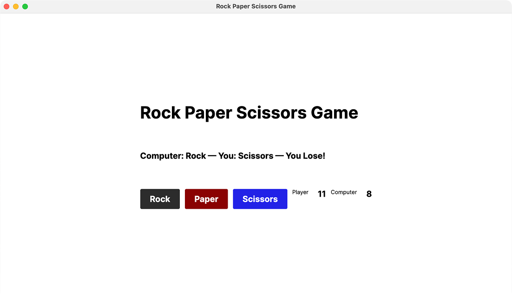

# Rock Paper Scissors (Avalonia UI)

A simple cross-platform desktop "Rock, Paper, Scissors" game built with **C#** and the **Avalonia UI** framework. The project follows the **MVP (Model-View-Presenter)** pattern, cleanly separating game logic, state, and the user interface.

Repository: [Empty-Developer/Rock-Paper-Scissors](https://github.com/Empty-Developer/Rock-Paper-Scissors)

---

## Table of Contents

- [Overview](#overview)
- [Screenshot](#screenshot)
- [Technologies](#technologies)
- [Architecture (MVP)](#architecture-mvp)
- [Project Structure](#project-structure)
- [How It Works](#how-it-works)
- [Installation and Running](#installation-and-running)
- [Possible Improvements](#possible-improvements)

---

## Overview

The user picks one of three moves — Rock, Paper, or Scissors — by clicking the corresponding button. The computer makes a random choice, the app determines the winner of the round, updates the player's and computer's score, and displays the round result on screen.

---

## Screenshot
 

 
---

## Technologies

| Technology | Purpose |
|---|---|
| **C# (.NET)** | Main development language |
| **Avalonia UI** | Cross-platform UI framework for building the window and layout (XAML) |
| **XAML** | Declarative description of the window's UI |
| **MVP (Model-View-Presenter)** | Architectural pattern separating data, logic, and presentation |

Avalonia lets the app run on **Windows, Linux, and macOS** without changing the code.

---

## Architecture (MVP)

The project follows the classic **Model – View – Presenter** pattern, which keeps the game logic independent of the UI and easy to test.

### Model — `DataGame`

Holds only the game state: the player's and computer's score.

```csharp
public class DataGame
{
    public int Player { get; private set; }
    public int Computer { get; private set; }

    public void AddPlayerCount() => Player++;
    public void AddComputerCount() => Computer++;
}
```

The model also defines the `GameObject` enum representing the three possible moves:

```csharp
public enum GameObject { Rock, Paper, Scissors }
```

The model **knows nothing** about the UI and contains no game rules — only data.

### Presenter — `GamePresenters`

Contains all of the game logic:

- generating a random move for the computer (`GetComputerObject`);
- determining the winner of the round according to the rock-paper-scissors rules (`GetResult`);
- updating the score through the model (`DataGame`);
- building the text result to display (`Play`).

The presenter receives the model through its constructor (dependency injection) and exposes ready-to-display data (`PlayerScore`, `ComputerScore`) plus a `Play(GameObject)` method that returns a string describing the round's result.

```csharp
public GamePresenters(DataGame game)
{
    _game = game;
}
```

The presenter has no dependency on Avalonia and holds no references to UI elements — it's pure C# logic.

### View — `MainWindow`

The application window (`MainWindow.axaml` + `MainWindow.axaml.cs`) is only responsible for:

- rendering the layout (buttons, labels, score);
- handling user clicks;
- calling the presenter and displaying the returned result in the UI elements.

```csharp
private void Play(GameObject playerObject)
{
    string result = _presenter.Play(playerObject);
    ResultLabel.Content = result;
    PlayerScoreLabel.Content = _presenter.PlayerScore;
    ComputerScoreLabel.Content = _presenter.ComputerScore;
}
```

The view contains no decision-making logic — that's fully delegated to the presenter, which is the core idea behind MVP.

### Interaction Flow

```
User
    │  clicks a button (Rock / Paper / Scissors)
    ▼
View (MainWindow)
    │  calls Presenter.Play(playerObject)
    ▼
Presenter (GamePresenters)
    │  generates the computer's move
    │  compares moves, determines the winner
    │  updates the score through the Model
    ▼
Model (DataGame)
    │  stores and returns the current score
    ▼
Presenter
    │  returns a result string
    ▼
View
    updates ResultLabel, PlayerScoreLabel, ComputerScoreLabel
```

---

## Project Structure

```
Rock-Paper-Scissors/
├── Model/
│   └── DataGame.cs          # GameObject enum + game state class
├── Presenters/
│   └── GamePresenters.cs    # Game logic and rules
├── View/
│   ├── MainWindow.axaml     # Window layout (XAML)
│   └── MainWindow.axaml.cs  # Code-behind: click handling
└── Program.cs                # Avalonia application entry point
```

---

## How It Works

1. On startup, the `MainWindow` is created, along with a `DataGame` model and a `GamePresenters` presenter that receives this model.
2. The user clicks one of the buttons — `Rock`, `Paper`, or `Scissors`.
3. The button's click handler calls `Play(GameObject)` on the presenter.
4. The presenter randomly picks the computer's move, compares it with the player's move, and determines the outcome: win, loss, or draw.
5. On a win or loss, the corresponding counter is updated in the model (`DataGame`).
6. The presenter returns a formatted result string, for example:

   ```
   Computer: Paper — You: Rock — You Lose!
   ```

7. The view displays this result in `ResultLabel` and updates the displayed player and computer scores.

---

## Installation and Running

### Requirements

- [.NET SDK](https://dotnet.microsoft.com/download) installed (version 6.0 or higher — check the exact version in the project's `.csproj` file).
- Git (to clone the repository).

### Steps

1. Clone the repository:

   ```bash
   git clone https://github.com/Empty-Developer/Rock-Paper-Scissors.git
   cd Rock-Paper-Scissors
   ```

2. Restore NuGet dependencies:

   ```bash
   dotnet restore
   ```

3. Run the application:

   ```bash
   dotnet run
   ```

The app will open in a window titled **"Rock Paper Scissors Game"**.

> If the solution contains multiple projects, specify the main project explicitly:
> ```bash
> dotnet run --project Rock-Paper-Scissors.csproj
> ```

### Building a Release Version

```bash
dotnet publish -c Release -r <RID> --self-contained true
```

where `<RID>` is the target platform identifier, e.g. `win-x64`, `linux-x64`, or `osx-x64`.

---

## Possible Improvements

- Extract the game rules and random move generator into a separate service to simplify unit testing of the presenter.
- Add an animation for the computer's move selection.
- Add a score reset feature and round history.
- Persist statistics between runs (e.g., in a local file or SQLite).
- Cover `GamePresenters` with unit tests — the logic is fully decoupled from the UI, which makes this straightforward thanks to the MVP architecture.

---

## License

This project is intended for educational/demonstration purposes. Please check the repository for the exact license if you plan to use the code commercially.